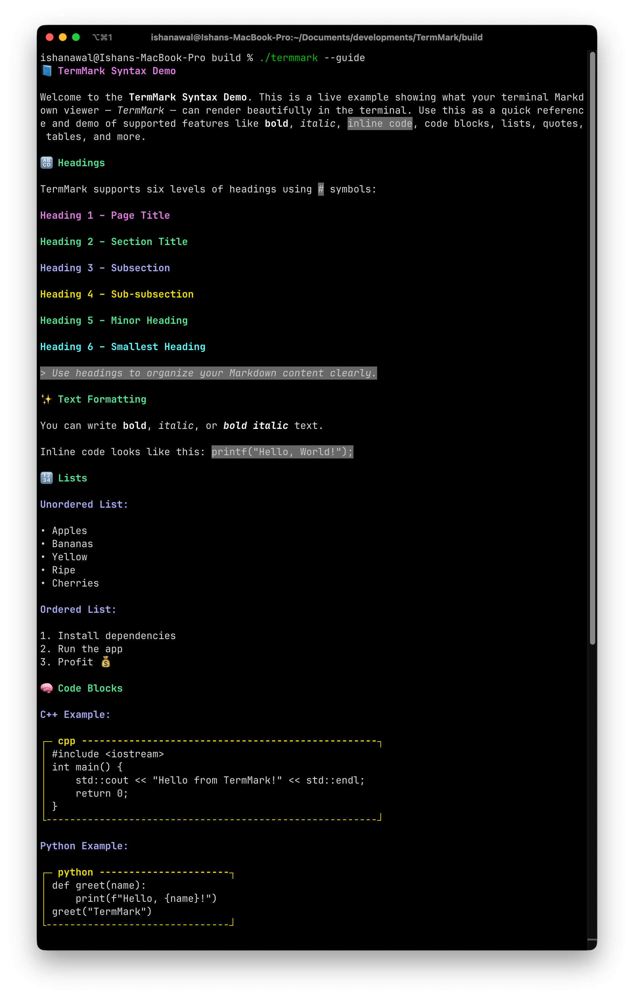
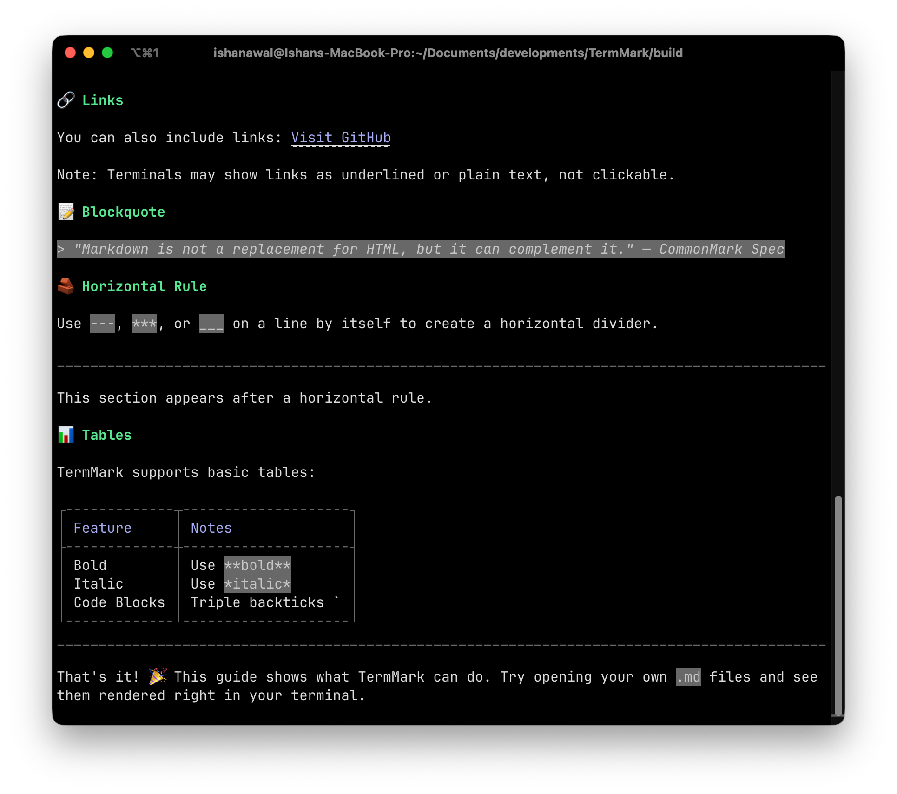

# TermMark

**TermMark** is a lightweight, C++-based terminal Markdown renderer designed for simplicity, readability, and modularity. It parses and renders `.md` files or embedded Markdown strings directly in the terminal with structured formatting — including headings, code blocks, lists, blockquotes, tables, and more.

---

### ✨ Features

- **Headings** with proper hierarchy and bold styling
- **Bold**, _italic_, and `inline code` rendering
- **Syntax-aware code blocks** with framed boxes and optional language labels
- **Unordered and ordered lists**
- **Blockquotes** and horizontal dividers
- **Simple Markdown table support**
- **Modular architecture** – easy to extend or integrate
- **`--help` and `--version` CLI flags**

---

### 🛠️ Getting Started

#### 🔧 Build Instructions

Make sure you have a C++17+ compatible compiler. Then:

```bash
git clone https://github.com/your-username/TermMark.git
cd TermMark
mkdir build && cd build
cmake ..
make
./termmark --help
```

---

### 🧪 Usage

You can render Markdown content in the terminal:

```bash
./termmark --guide      # Renders a built-in markdown guide
./termmark README.md    # Renders any local .md file
```

Use the flags:

```bash
./termmark --help
./termmark --version
./termmark --watch <file.md>
```

---

### Sample Output




---

### 📁 Project Structure

```bash
TERMMARK/
├── include/               # Header files
│   ├── parser/            # Markdown parser interface
│   ├── renderer/          # Renderer interface
│   └── utils/             # CLI info, styles, compatibility
├── src/                   # Implementation files
│   ├── parser/            # Markdown parser implementation
│   ├── renderer/          # Terminal renderer implementation
│   └── utils/             # CLI tools and helpers
├── sample.md              # Sample markdown input
├── main.cpp               # Entry point
├── CMakeLists.txt         # Build configuration
├── README.md              # Project documentation
├── LICENSE                # License info
```

---

### 📦 Dependencies

- **Standard C++ STL only** — No external dependencies!

---

### 📌 Future Plans

- [ ] Support images as alt-text
- [ ] Terminal link detection
- [ ] Live preview for `.md` editing
- [ ] Color themes or syntax highlighting

---

### 👨‍💻 Author

Built with ❤️ by [Ishan Awal](https://github.com/Codewire-github)

If you like it, consider ⭐️ starring the repo!

---

### 🧾 License

This project is licensed under the MIT License.
See the [LICENSE](./LICENSE) file for details.
